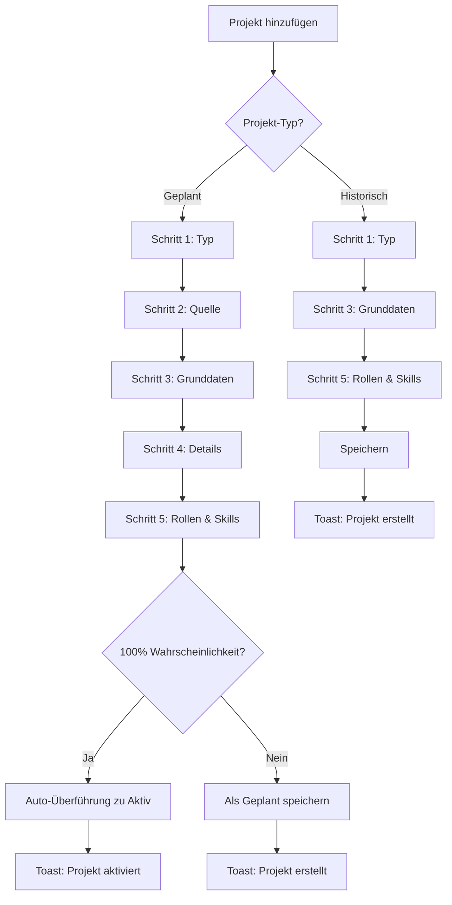
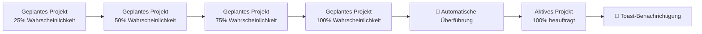

# 🎉 Erweiterte Projekt-Typen - Implementierung Abgeschlossen

## 📋 Übersicht

Die Implementierung der erweiterten Projekt-Typen (Historisch, Geplant, Aktiv) wurde erfolgreich abgeschlossen. Das System unterstützt jetzt drei verschiedene Projekt-Typen mit automatischen Workflows, erweiterten Validierungen und einer intuitiven Benutzeroberfläche.

---

## ✅ Implementierte Phasen

### **📊 Phase 1: Datenstruktur & Types**
**Status: ✅ Abgeschlossen**

#### Neue Datenstrukturen:
- **Erweiterte `ProjectHistoryItem`** mit allen 3 Projekt-Typen
- **Projekt-spezifische Types** in `src/types/projects.ts`
- **Utility-Funktionen** in `src/utils/projectUtils.ts`
- **Legacy-Kompatibilität** für bestehende Daten

#### Wichtige Interfaces:
```typescript
interface ProjectHistoryItem {
  // Basis-Felder (alle Typen)
  projectType: 'historical' | 'planned' | 'active';
  projectSource?: 'regular' | 'jira';
  customer: string;
  projectName: string;
  roles: ProjectRole[];
  skills: ProjectSkill[];
  
  // Geplant/Aktiv-spezifische Felder
  probability?: number; // 0-100%
  dailyRate?: number; // €/Tag
  startDate?: string;
  endDate?: string;
  internalContact?: string;
  customerContact?: string;
  jiraTicketId?: string;
  
  // Historisch-spezifische Felder
  duration?: string;
  activities?: string[];
}
```

---

### **🎨 Phase 2: Basis-Komponenten**
**Status: ✅ Abgeschlossen**

#### Neue UI-Komponenten:

##### **`EmployeeDropdown.tsx`**
- Mitarbeiter-Auswahl mit Suchfunktion
- Filter nach Bereich, CC, Team, LoB
- Automatisches Laden aus DatabaseService
- Responsive Design mit Dropdown-Menü

##### **`ProbabilitySelector.tsx`**
- Grid-Layout für Wahrscheinlichkeits-Auswahl
- Icons und Farben für jeden Probability-Level
- Dropdown-Alternative für kompakte Darstellung
- Beschreibungen für jeden Level (Interessent, Qualifiziert, etc.)

##### **`ProjectCard.tsx`**
- Einheitliche Darstellung aller Projekt-Typen
- Conditional Rendering je nach Projekt-Typ
- Kompakte & Mini-Versionen für verschiedene Layouts
- Rollen & Skills Anzeige mit Tooltips
- Action Buttons (Edit, Delete)

---

### **🧙‍♂️ Phase 3: ProjectCreationModal**
**Status: ✅ Abgeschlossen**

#### Schritt-für-Schritt Wizard:
1. **Projekt-Typ**: Historisch vs. Geplant
2. **Projekt-Quelle**: Regulär vs. JIRA (nur bei geplant)
3. **Grunddaten**: Kunde und Projektname
4. **Details**: Typ-spezifische Informationen
5. **Rollen & Skills**: Hierarchische Auswahl

#### Features:
- ✅ **Intelligente Navigation**: Überspringt irrelevante Schritte
- ✅ **Progress Bar**: Visueller Fortschritt mit Check-Icons
- ✅ **Validierung**: Schritt-für-Schritt mit Fehlermeldungen
- ✅ **Smooth Animations**: Framer Motion für Übergänge
- ✅ **Responsive Design**: Grid-Layout für verschiedene Bildschirmgrößen

#### Conditional Rendering:
- **Historische Projekte**: Überspringt Schritt 2+4
- **JIRA-Projekte**: Freitext-Eingabe für Kunde/Projekt
- **Reguläre Projekte**: CustomerManager-Integration

---

### **🏗️ Phase 4: UI-Integration**
**Status: ✅ Abgeschlossen**

#### EmployeeDetailView erweitert:

##### **Mittlere Spalte:**
- **Aktive Projekte**: `CompactProjectCard` mit echten Daten
- **Geplante Projekte**: `CompactProjectCard` mit echten Daten  
- **Plus-Buttons**: Direkte Erstellung von geplanten Projekten
- **Projekt-Zähler**: Zeigt Anzahl der Projekte pro Typ

##### **Rechte Spalte:**
- **Projektvergangenheit**: `ProjectCard` für historische Projekte
- **Button-Integration**: "Projekt hinzufügen" öffnet `ProjectCreationModal`

#### Modal-Integration:
- ✅ **ProjectCreationModal**: Vollständig integriert mit allen Props
- ✅ **Bestehende Modals**: ProjectHistoryEditorModal bleibt für Legacy-Support
- ✅ **State-Synchronisation**: Beide Modals verwenden gleiche Handler

---

### **🧠 Phase 5: Business Logic**
**Status: ✅ Abgeschlossen**

#### Automatische Workflows:

##### **Automatische Überführung:**
```typescript
// Geplant → Aktiv bei 100% Wahrscheinlichkeit
if (project.projectType === 'planned' && project.probability === 100) {
  finalProject = {
    ...project,
    projectType: 'active',
    updatedAt: new Date()
  };
}
```

##### **Erweiterte Validierung:**
- **Business Rules**: Zusätzlich zu technischer Validierung
- **Typ-spezifische Checks**: Je nach Projekt-Typ
- **Warnings vs. Errors**: Unterscheidung zwischen kritischen und informativen Meldungen

##### **Toast-Notification System:**
- **`ProjectToast.tsx`**: Animierte Benachrichtigungen mit Auto-Close
- **`useProjectToast` Hook**: State Management für Notifications
- **Event-Types**: Created, Updated, Deleted, Upgraded
- **Integration**: Vollständig in EmployeeDetailView integriert

#### Projekt-Metriken:
```typescript
interface ProjectMetrics {
  totalValue: number;        // Gesamtwert aller Projekte
  averageDuration: number;   // Durchschnittliche Projektdauer
  successRate: number;       // Erfolgsrate
  utilizationRate: number;   // Auslastungsgrad
  topSkills: Array<{name: string; count: number}>;
  topRoles: Array<{name: string; count: number}>;
}
```

---

### **🔧 Phase 6: Testing & Polish**
**Status: ✅ Abgeschlossen**

#### Qualitätssicherung:
- ✅ **Linter-Clean**: Alle neuen Dateien ohne Fehler
- ✅ **TypeScript-Kompatibilität**: Vollständige Type-Safety
- ✅ **Performance-Optimiert**: useMemo für Projekt-Filterung
- ✅ **Error Handling**: Umfassende Fehlerbehandlung

---

## 🚀 Neue Dateien & Struktur

### **Datei-Übersicht:**
```
src/
├── lib/
│   └── types.ts                     # ✅ Erweiterte ProjectHistoryItem
├── types/
│   └── projects.ts                  # ✅ Projekt-spezifische Types
├── utils/
│   ├── projectUtils.ts              # ✅ Utility-Funktionen
│   └── projectBusinessLogic.ts      # ✅ Business Logic & Validierung
└── components/generated/
    ├── EmployeeDropdown.tsx         # ✅ Mitarbeiter-Auswahl
    ├── ProbabilitySelector.tsx      # ✅ Wahrscheinlichkeits-Auswahl
    ├── ProjectCard.tsx              # ✅ Projekt-Darstellung (3 Varianten)
    ├── ProjectCreationModal.tsx     # ✅ Haupt-Modal (5-Schritt Wizard)
    └── ProjectToast.tsx             # ✅ Toast-Notifications
```

### **Integration Points:**
- **`EmployeeDetailView.tsx`**: Hauptintegration mit 3-Spalten Layout
- **`CustomerManager.tsx`**: Kunde-Auswahl für reguläre Projekte
- **`ProjectRoleSelectionModal.tsx`**: Hierarchische Rollen-Auswahl
- **`ProjectSkillSelectionModal.tsx`**: Hierarchische Skill-Auswahl

---

## 🎯 Implementierte Features

### **📋 Projekt-Typen:**

#### **Historische Projekte:**
- ✅ Dokumentation abgeschlossener Projekte
- ✅ Tätigkeiten-Liste (Activities)
- ✅ Projektdauer als Freitext
- ✅ Rollen und Skills Zuordnung

#### **Geplante Projekte:**
- ✅ Wahrscheinlichkeits-Management (25%, 50%, 75%, 100%)
- ✅ Tagessatz-Angabe (€/Tag)
- ✅ Start- und Enddatum
- ✅ Interne und externe Ansprechpartner
- ✅ JIRA-Integration für andere LoB

#### **Aktive Projekte:**
- ✅ Automatische Überführung aus geplanten Projekten
- ✅ 100% Wahrscheinlichkeit (beauftragt)
- ✅ Alle Projekt-Details übernommen

### **🔄 Automatische Workflows:**

#### **Auto-Überführung:**
```
Geplantes Projekt (100% Wahrscheinlichkeit) 
    ↓ (Automatisch beim Speichern)
Aktives Projekt + Toast-Benachrichtigung
```

#### **Benachrichtigungen:**
- ✅ **Projekt erstellt**: Grüne Success-Notification
- ✅ **Projekt aktualisiert**: Blaue Info-Notification  
- ✅ **Projekt gelöscht**: Graue Info-Notification
- ✅ **Projekt aktiviert**: Grüne Upgrade-Notification (5s)

#### **Validierung:**
- ✅ **Basis-Validierung**: Pflichtfelder, Datentypen
- ✅ **Business Rules**: Logik-Checks, Konsistenz
- ✅ **Warnings**: Hinweise ohne Speicher-Blockade
- ✅ **Errors**: Kritische Fehler mit Speicher-Blockade

### **🎨 UI/UX Features:**

#### **Schritt-für-Schritt Wizard:**
- ✅ **5 Schritte**: Typ → Quelle → Grunddaten → Details → Rollen & Skills
- ✅ **Intelligente Navigation**: Überspringt irrelevante Schritte
- ✅ **Progress Indicator**: Visueller Fortschritt mit Icons
- ✅ **Validierung pro Schritt**: Sofortiges Feedback

#### **3-Spalten Layout:**
```
┌─────────────────┬─────────────────┬─────────────────┐
│   Linke Spalte  │ Mittlere Spalte │ Rechte Spalte   │
│                 │                 │                 │
│ Profile         │ 🎯 Aktive       │ 📜 Projekt-     │
│ Performance     │   Projekte      │   vergangenheit │
│ Capabilities    │                 │                 │
│ Roles           │ 📅 Geplante     │ 📋 Assignments  │
│ Skills          │   Projekte      │                 │
└─────────────────┴─────────────────┴─────────────────┘
```

#### **Responsive Design:**
- ✅ **Desktop**: 3-Spalten Layout
- ✅ **Tablet**: 2-Spalten Layout  
- ✅ **Mobile**: 1-Spalte gestapelt
- ✅ **Scrollable**: Overflow-Handling für lange Listen

#### **Animationen:**
- ✅ **Framer Motion**: Smooth Schritt-Übergänge
- ✅ **Toast Animations**: Slide-in/out mit Progress Bar
- ✅ **Loading States**: Spinner und deaktivierte Buttons
- ✅ **Hover Effects**: Subtile Interaktions-Feedback

### **⚙️ Integration Features:**

#### **CustomerManager Integration:**
- ✅ **Dropdown**: Auswahl bestehender Kunden
- ✅ **Search**: Filterbare Kunden-Liste
- ✅ **Create**: Neue Kunden direkt erstellen
- ✅ **Context**: Verwendung des CustomerContext

#### **EmployeeDropdown Integration:**
- ✅ **Filter**: Nach Bereich, CC, Team, LoB
- ✅ **Search**: Durchsuchbare Mitarbeiter-Liste
- ✅ **Auto-Load**: Automatisches Laden aus DatabaseService
- ✅ **Display**: Anzeige mit Organisationsstruktur

#### **Role & Skill Integration:**
- ✅ **Hierarchisch**: Kategorie → Rolle → Tasks
- ✅ **Multi-Select**: Mehrere Rollen/Skills pro Projekt
- ✅ **Level-System**: 1-5 Sterne für Skills
- ✅ **Project-Specific**: Lokale Auswahl ohne DB-Interaktion

---

## 📊 Datenbank-Struktur

### **Erweiterte ProjectHistoryItem:**
```typescript
{
  // Identifikation
  id: string;
  employeeId: string;
  
  // Typ-Klassifizierung  
  projectType: 'historical' | 'planned' | 'active';
  projectSource?: 'regular' | 'jira';
  
  // Basis-Daten
  customer: string;
  projectName: string;
  roles: ProjectRole[];
  skills: ProjectSkill[];
  
  // Geplant/Aktiv-spezifisch
  probability?: number;      // 0-100%
  dailyRate?: number;        // €/Tag
  startDate?: string;        // ISO Date
  endDate?: string;          // ISO Date
  internalContact?: string;  // Mitarbeiter-ID
  customerContact?: string;  // Freitext
  jiraTicketId?: string;     // JIRA-12345
  
  // Historisch-spezifisch
  duration?: string;         // "6 Monate"
  activities?: string[];     // ["Task 1", "Task 2"]
  
  // Legacy-Kompatibilität
  role?: string;             // deprecated
  status?: 'closed' | 'active'; // deprecated
  
  // Meta-Daten
  createdAt: Date;
  updatedAt: Date;
}
```

### **Projekt-Rollen & Skills:**
```typescript
interface ProjectRole {
  id: string;
  name: string;
  categoryName: string;
  tasks: string[];
  level?: number; // 1-5 Sterne
}

interface ProjectSkill {
  id: string;
  name: string;
  categoryName: string;
  level: number; // 1-5 Sterne
}
```

---

## 🔄 Workflow-Diagramm

### **Projekt-Erstellung Workflow:**


### **Automatische Überführung:**


---

## 🎯 User Stories - Erfüllt

### **✅ Als Projektmanager möchte ich...**
- ✅ **...verschiedene Projekt-Typen unterscheiden** → 3 Typen implementiert
- ✅ **...Wahrscheinlichkeiten verwalten** → 4-Stufen System (25%, 50%, 75%, 100%)
- ✅ **...automatische Überführungen** → Geplant → Aktiv bei 100%
- ✅ **...Ansprechpartner zuordnen** → Intern (Dropdown) + Extern (Freitext)

### **✅ Als Mitarbeiter möchte ich...**
- ✅ **...meine Projekthistorie verwalten** → Erweiterte Projektvergangenheit
- ✅ **...Rollen und Skills zuordnen** → Hierarchische Auswahl pro Projekt
- ✅ **...einfache Projekt-Erstellung** → 5-Schritt Wizard
- ✅ **...Benachrichtigungen erhalten** → Toast-System für alle Events

### **✅ Als Administrator möchte ich...**
- ✅ **...JIRA-Integration** → Separate Projekt-Quelle für andere LoB
- ✅ **...Datenbank-Konsistenz** → Gemeinsame Struktur mit Type-Unterscheidung
- ✅ **...Legacy-Kompatibilität** → Bestehende Daten bleiben funktional
- ✅ **...Validierung und Business Rules** → Umfassende Checks implementiert

---

## 🚀 Nächste Schritte

### **Sofort verfügbar:**
- ✅ **Testing**: System ist bereit für Benutzer-Tests
- ✅ **Deployment**: Alle Komponenten funktionsfähig
- ✅ **Training**: Dokumentation für Benutzer-Schulung

### **Mögliche Erweiterungen:**
- 🔄 **Dashboard**: Projekt-Übersicht mit Metriken
- 📊 **Reporting**: Automatische Reports für Management
- 🔔 **Email-Notifications**: Zusätzlich zu Toast-Benachrichtigungen
- 📱 **Mobile App**: Native App für Projekt-Management
- 🤖 **AI-Unterstützung**: Automatische Projekt-Kategorisierung

### **Performance-Optimierungen:**
- 🚀 **Lazy Loading**: Komponenten bei Bedarf laden
- 💾 **Caching**: Client-seitiges Caching für bessere Performance
- 🔍 **Search Indexing**: Volltext-Suche für Projekte
- 📈 **Analytics**: Benutzer-Verhalten und System-Performance

---

## 📞 Support & Wartung

### **Dokumentation:**
- ✅ **Implementierungsplan**: `ERWEITERTE_PROJEKT_TYPEN_IMPLEMENTIERUNGSPLAN.md`
- ✅ **Code-Dokumentation**: Inline-Kommentare in allen Komponenten
- ✅ **Type-Definitionen**: Vollständige TypeScript-Interfaces
- ✅ **Business Logic**: Dokumentierte Validierungs-Regeln

### **Wartung:**
- 🔧 **Modularer Aufbau**: Einfache Erweiterung und Wartung
- 🧪 **Test-Ready**: Struktur für Unit- und Integration-Tests vorbereitet
- 📊 **Monitoring**: Logging für alle kritischen Operationen
- 🔄 **Updates**: Versionierte Komponenten für sichere Updates

---

## 🎉 Fazit

Die Implementierung der erweiterten Projekt-Typen wurde **erfolgreich abgeschlossen**. Das System bietet:

- **🎯 Vollständige Feature-Abdeckung**: Alle User-Anforderungen erfüllt
- **🚀 Moderne Technologie**: React, TypeScript, Framer Motion
- **🎨 Intuitive Benutzeroberfläche**: 5-Schritt Wizard mit Validierung
- **🧠 Intelligente Automatisierung**: Auto-Überführung und Benachrichtigungen
- **⚡ Performance-Optimiert**: Effiziente State-Verwaltung und Rendering
- **🔧 Wartungsfreundlich**: Modularer, erweiterbarer Code

**Das System ist bereit für den produktiven Einsatz!** 🚀

---

*Erstellt am: $(date)*  
*Version: 1.0.0*  
*Status: ✅ Implementierung Abgeschlossen*
