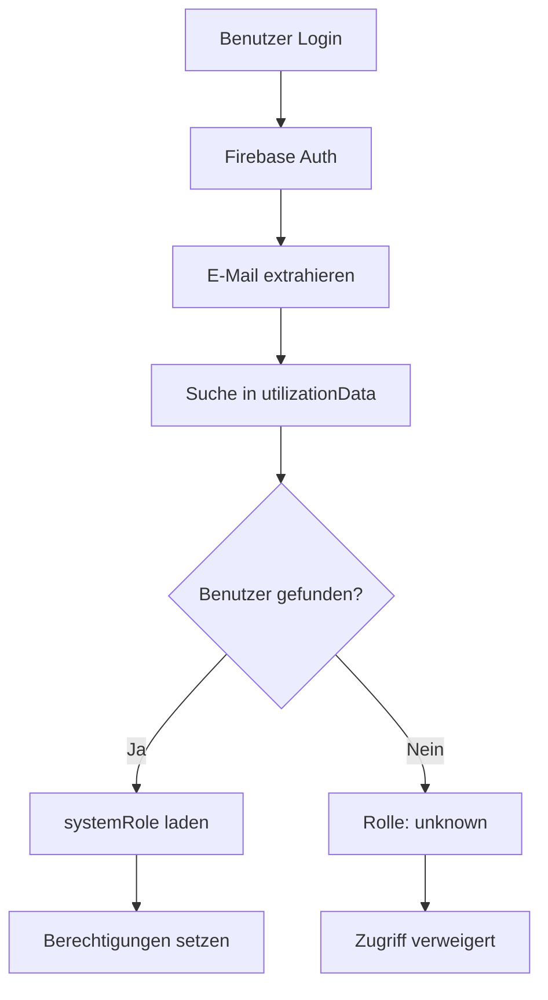
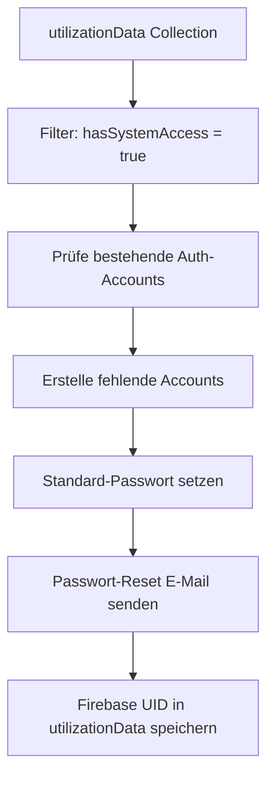

# 🔐 Firebase Authentication Integration Konzept

## 📋 Überblick

Dieses Dokument beschreibt die vollständige Integration zwischen Firebase Authentication und unserem rollenbasierten Zugriffssystem.

## 🎯 Ziele

1. **Automatische Account-Erstellung** für alle Benutzer mit System-Zugriff
2. **Nahtlose Rollen-Integration** zwischen Login und Berechtigungen
3. **Skalierbare Benutzerverwaltung** ohne manuelle Eingriffe
4. **Sichere Standard-Passwörter** mit erzwungener Änderung

## 🏗️ Architektur

### **1. Datenfluss: Login → Rolle**



### **2. Account-Erstellung Pipeline**



## 🔧 Implementierung

### **Frontend-Komponenten**

#### **1. FirebaseAuthBulkSetup.tsx**
- **Zweck:** Admin-Interface für Bulk-Account-Erstellung
- **Features:**
  - Analyse aller Benutzer mit System-Zugriff
  - Statistiken nach Rollen
  - CSV-Export der Benutzerliste
  - Simulation der Account-Erstellung
  - Passwort-Reset Link Generation

#### **2. AuthContext.tsx (erweitert)**
- **Zweck:** Automatisches Rollen-Mapping beim Login
- **Logik:**
  ```typescript
  // Login-E-Mail → utilizationData Suche
  const userRole = await loadUserRoleFromUtilizationData(user.email);
  
  // Berechtigungen basierend auf Rolle setzen
  setRole(userRole);
  ```

### **Backend-Scripts**

#### **1. firebase-auth-bulk-setup.cjs**
- **Zweck:** Server-seitige Account-Erstellung mit Firebase Admin SDK
- **Funktionen:**
  - `loadUsersWithSystemAccess()` - Lädt alle berechtigten Benutzer
  - `checkExistingAuthUsers()` - Prüft bestehende Accounts
  - `createFirebaseAuthAccounts()` - Erstellt neue Accounts
  - `generatePasswordResetLinks()` - Generiert Reset-Links
  - `exportUserCredentials()` - CSV-Export

#### **2. Ausführung:**
```bash
# Dry Run (Vorschau)
node firebase-auth-bulk-setup.cjs

# Echte Ausführung
node firebase-auth-bulk-setup.cjs --create

# Mit Passwort-Reset E-Mails
node firebase-auth-bulk-setup.cjs --create --send-reset
```

## 📊 Datenstruktur

### **utilizationData Collection (erweitert)**

```typescript
interface UtilizationDataUser {
  id: string;                    // Firestore Document ID
  person: string;                // "Nachname, Vorname"
  email: string;                 // Login-E-Mail
  systemRole: UserRole;          // 'admin' | 'führungskraft' | 'sales' | 'user'
  hasSystemAccess: boolean;      // Berechtigung für System-Zugriff
  
  // Neue Firebase Auth Felder
  firebaseUid?: string;          // Firebase Auth UID
  authAccountCreated?: Timestamp; // Wann Account erstellt
  authAccountCreatedBy?: string;  // Wer hat Account erstellt
  
  // Bestehende Felder
  lbs: string;                   // Laufbahnstufe
  bereich: string;               // Geschäftsbereich
  vg: string;                    // Vorgesetzter
  // ... weitere Felder
}
```

### **Firebase Auth User Record**

```typescript
interface FirebaseAuthUser {
  uid: string;                   // Eindeutige Firebase UID
  email: string;                 // Login-E-Mail (aus utilizationData)
  displayName: string;           // person Feld (aus utilizationData)
  password: string;              // Standard: "TempPass2024!"
  emailVerified: false;          // Muss beim ersten Login verifiziert werden
  disabled: false;               // Account aktiv
}
```

## 🔐 Sicherheitskonzept

### **1. Standard-Passwort**
- **Passwort:** `TempPass2024!`
- **Sicherheit:** Muss beim ersten Login geändert werden
- **Verteilung:** Über CSV-Export oder Passwort-Reset E-Mails

### **2. Berechtigungsprüfung**
```typescript
// Beim Login
const userRole = await loadUserRoleFromUtilizationData(email);

// Bei jeder Aktion
if (!canAccessView(userRole, 'employees')) {
  // Zugriff verweigert
}
```

### **3. Rollen-Hierarchie**
1. **Admin:** Vollzugriff auf alles
2. **Führungskraft:** Auslastung + Mitarbeiter + Excel-Upload
3. **Sales:** Nur Sales-View
4. **User:** Nur Auslastung-View (später nur eigenes Profil)

## 🚀 Deployment-Prozess

### **Phase 1: Vorbereitung**
1. Rollen-Zuweisung mit AutoRoleAssignment durchführen
2. `hasSystemAccess` für alle relevanten Benutzer setzen
3. Firebase Admin SDK Service Account konfigurieren

### **Phase 2: Account-Erstellung**
1. FirebaseAuthBulkSetup öffnen
2. Statistiken überprüfen
3. CSV-Export herunterladen
4. Bulk-Account-Erstellung ausführen
5. Passwort-Reset E-Mails versenden

### **Phase 3: Benutzer-Onboarding**
1. Benutzer erhalten E-Mail mit Reset-Link
2. Neues Passwort setzen
3. Automatisches Rollen-Mapping beim Login
4. Zugriff basierend auf Rolle

## 📧 E-Mail-Templates

### **Passwort-Reset E-Mail**
```
Betreff: Ihr Zugang zum Ressource Utilization System

Hallo [Name],

Sie haben Zugang zum Ressource Utilization System erhalten.

Ihre Rolle: [systemRole]
Ihre E-Mail: [email]

Klicken Sie hier um Ihr Passwort zu setzen:
[Reset-Link]

Nach dem Login haben Sie Zugriff auf:
- [Liste der verfügbaren Views basierend auf Rolle]

Bei Fragen wenden Sie sich an: [Admin-Kontakt]
```

## 🔄 Wartung & Updates

### **Neue Benutzer hinzufügen**
1. Benutzer in utilizationData Collection anlegen
2. Rolle mit AutoRoleAssignment zuweisen
3. `hasSystemAccess: true` setzen
4. FirebaseAuthBulkSetup erneut ausführen

### **Rollen ändern**
1. `systemRole` in utilizationData aktualisieren
2. Beim nächsten Login wird neue Rolle geladen
3. Kein Firebase Auth Update nötig

### **Benutzer deaktivieren**
1. `hasSystemAccess: false` setzen
2. Optional: Firebase Auth Account deaktivieren

## 🎯 Vorteile dieser Lösung

✅ **Skalierbar:** Hunderte Benutzer automatisch verwalten
✅ **Zentral:** Alle Rollen in utilizationData Collection
✅ **Flexibel:** Rollen-Änderungen ohne Auth-Updates
✅ **Sicher:** Standard-Passwort + erzwungene Änderung
✅ **Auditierbar:** Vollständige Nachverfolgung aller Änderungen
✅ **Benutzerfreundlich:** Automatisches Rollen-Mapping beim Login

## 🚨 Wichtige Hinweise

⚠️ **Firebase Admin SDK erforderlich:** Server muss mit Service Account konfiguriert werden
⚠️ **E-Mail-Versand:** SMTP-Server für Passwort-Reset E-Mails konfigurieren
⚠️ **Domain-Konfiguration:** Reset-Links müssen auf korrekte Domain zeigen
⚠️ **Backup:** Vor Bulk-Operationen immer Backup der utilizationData erstellen

## 📞 Support

Bei Problemen mit der Firebase Auth Integration:

1. **Logs prüfen:** Browser-Konsole und Server-Logs
2. **Rollen-Mapping:** AuthContext Debug-Ausgaben
3. **Account-Status:** Firebase Console überprüfen
4. **Berechtigungen:** permissions.ts Logik validieren
